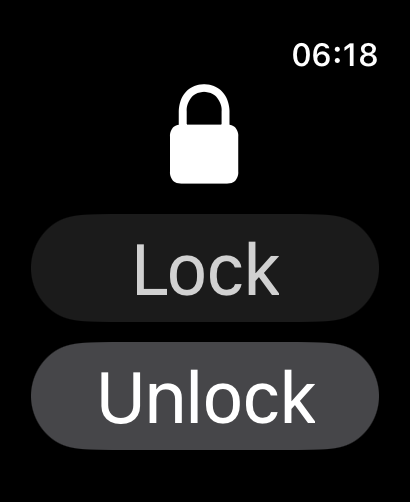
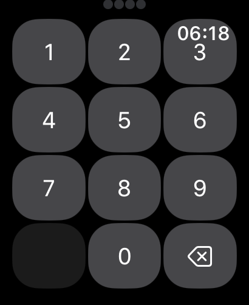

# BlueLink Brazil 🚗💻 + ⌚ Watch App

## ⚡ Overview

Welcome to **BlueLink Brazil**, a seamless integration between **Hyundai's BlueLink services** for Brazil and an intuitive **Apple Watch app** that puts control of your vehicle at your fingertips. Whether you're in your car or on the go, you can manage your vehicle's doors, validate your PIN securely, and much more, all from the convenience of your wrist.

---

## 💻 Features

### **API Backend**

- **Authentication:** Login and generate access tokens with ease.
- **PIN Services:** Securely validate PINs and generate control tokens.
- **Vehicle Management:** Retrieve vehicle data and control doors (open/close).

### **Apple Watch App**

- **Control Vehicle Doors:** Lock or unlock your vehicle directly from your Apple Watch.
- **PIN Validation:** Input your PIN for secure vehicle control.
- **Real-Time Feedback:** See the status of your vehicle door (locked or unlocked).

---

## 🚀 Getting Started

### 1️⃣ Prerequisites

- **Backend:**

  - Node.js >= 16.x
  - npm or yarn
  - Hyundai BlueLink account (Brazil region only)

- **Watch App:**
  - Xcode installed
  - Apple Watch (or simulator)
  - macOS for development and testing

### 2️⃣ Installation

Clone the repository and install both the backend API and Watch App:

```bash
git clone https://github.com/yourname/bluelink-br-api.git
cd bluelink-br-api
npm install
```

Navigate to the `watch-app` folder and open the Xcode project:

```bash
cd watch-app/bluelink-br Watch App
open bluelink-br.xcodeproj
```

### 3️⃣ Configuration

#### Watch App Configuration

No specific configuration needed—just make sure your Apple Watch is connected or use the simulator.

### 4️⃣ Running the App

#### Backend

Start the server with the following command:

```bash
npm run dev
```

Access the Swagger docs at: [http://localhost:3000/api-docs](http://localhost:3000/api-docs)

#### Watch App Configuration

To set up the **BlueLink Watch App**, follow these steps:

1. **Xcode Setup**

   - Open the **Watch App project** in Xcode:
     ```bash
     cd watch-app/bluelink-br Watch App
     open bluelink-br.xcodeproj
     ```
   - Ensure that your Xcode project is set up with an **Apple Watch** target.

2. **Change Credentials in ContentView.swift**

   - To connect the Watch App to the **BlueLink API**, you need to update the credentials in the `ContentView.swift` file.

   - Open `ContentView.swift` in Xcode and locate the section where the credentials are defined:

     ```swift
         let userEmail = "your@mail.com"  // <-- Replace with your actual email
         let userPassword = "easy123"     // <-- Replace with your actual password
     ```

   - Replace `your@mail.com` with your **Hyundai BlueLink account email**.
   - Replace `easy123` with your **Hyundai BlueLink account password**.

   > **Note:** Ensure that you are using a **Hyundai BlueLink account** for the **Brazil region** to authenticate successfully.

3. **Warning: API pointing to localhost:3000**

   - The **Watch App** is configured to interact with the **backend API running on localhost:3000** by default. If you're running the backend locally, ensure the server is up and running on port **3000**.
   - If you need to change the backend URL (e.g., for a production environment), make sure to update the `ContentView.swift` and `LockUnlockScreen.swift` to point to the correct API endpoint.

4. **Running the Watch App on Your Device or Simulator**

   - Make sure your **Apple Watch** is connected to your development machine via **Xcode**. If you're using a simulator, select your **Apple Watch target** in Xcode and click **Run** to launch the Watch app.
   - You can now test the Watch App with the configured **user credentials**.

5. **Access the API**
   - Once the credentials are updated, the app will authenticate with the **BlueLink API** using the provided email and password.
   - The backend will generate the necessary access and control tokens for the Watch App to interact with your vehicle.

---

## 🔑 Endpoints (Backend)

### Authentication

- **POST /auth/login**  
  Input your email and password, and get back the tokens required for authentication.

### PIN Services

- **PUT /pin**  
  Validate the PIN and return the control token used to operate your vehicle.

### Vehicle Management

- **GET /vehicle**  
  Retrieve data on all registered vehicles linked to your account.

- **POST /vehicle/control-door**  
  Open or close the vehicle doors, allowing full control through the Watch app.

- **GET /vehicle/{vehicleId}/status**  
  Retrieve the current status of your vehicle, including information such as whether the door is locked or unlocked.

---

## 📱 Watch App Screenshots

Take a look at the **BlueLink Watch App** in action! From controlling vehicle doors to validating your PIN, this app makes it easy to manage your Hyundai BlueLink features directly from your wrist.




---

## ⚙️ How It Works

### Backend API

The **BlueLink Brazil API** is the backend that powers the Apple Watch app. It handles all the core operations, including authentication, PIN validation, and vehicle door control. The API interacts with Hyundai's BlueLink services and makes this data available to the Watch App.

### Apple Watch App

The **Watch App** communicates directly with the backend API to perform vehicle actions. It uses the control tokens generated by the backend to ensure secure and efficient interactions with the vehicle's systems. With the app, users can:

- **Control vehicle doors**: Lock and unlock your vehicle remotely.
- **Validate PINs**: Securely authenticate and validate PINs for added security.

---

## ⚔️ Contribute Like a Pro

1. Fork the repo.
2. Clone your forked repo.
3. Create a feature branch: `git checkout -b my-feature`
4. Commit your changes: `git commit -m 'Add some feature'`
5. Push your branch: `git push origin my-feature`
6. Submit a pull request.

---

## 🛡️ Legal Disclaimer

This project is intended for educational purposes only. Use at your own discretion. By using this API, you agree to comply with all Hyundai BlueLink terms and conditions.

---

## 🚗✨ License

This code is provided for reference and learning purposes only.  
It is not allowed to copy, modify, redistribute, or use it for any commercial or personal purposes without the explicit permission of the author.

---

> _No warranties, no guarantees – you're on your own. Use responsibly._

---
